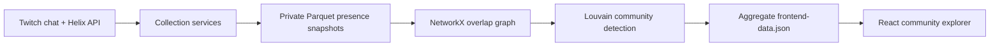

# ViewerAtlas

[](https://github.com/Von-Van/vieweratlas/actions/workflows/ci.yml)
[](https://github.com/Von-Van/vieweratlas/actions/workflows/security.yml)
[](LICENSE)

ViewerAtlas is an open-source data pipeline and interactive visualization for
mapping Twitch communities through shared audience presence. It turns sampled
chat participation into a weighted channel-overlap graph, detects communities
with the Louvain algorithm, and exports an explorable React frontend.

> **Portfolio status:** the project is deployment-ready but is not currently
> hosted. The frontend clearly labels its bundled demonstration dataset and
> switches to validated aggregate data when `VITE_DATA_URL` is configured.

## Why It Is Interesting

- End-to-end system: Twitch collection, Parquet storage, graph analysis, and a
  production-built visualization
- Local and AWS execution paths with Docker, ECS, S3, SQS, DynamoDB, CloudFront,
  monitoring, rollback, and cost controls
- Privacy-conscious public boundary: raw presence data stays private while the
  browser receives channel-level aggregates
- Security gates for Python and npm dependencies, static analysis, tests,
  frontend type checking, and deployment preflight validation

## Architecture



## What It Does

1. Discovers channels through the Twitch Helix API.
2. Samples live chatters in configurable channel batches.
3. Optionally processes VOD chat, discarding raw message-bearing artifacts by
   default after extracting presence snapshots.
4. Aggregates snapshots into channel-to-viewer sets.
5. Builds a weighted overlap graph where shared viewers determine edge weight.
6. Detects and labels communities.
7. Exports PNG, HTML, CSV, JSON, and frontend-ready aggregate artifacts.

## Public Data Boundary

Raw presence snapshots contain observed Twitch usernames and must remain private.
Usernames are pseudonymous identifiers and may still be personal data. The
public frontend is designed to receive only `data/frontend-data.json`, which
contains channel-level nodes, overlaps, community labels, and aggregate metrics.

See [DATA_POLICY.md](twitchiobot/docs/DATA_POLICY.md) for the full operational
policy and [SECURITY.md](SECURITY.md) for reporting and deployment guidance.

## Run Locally

### Pipeline

```bash
cd twitchiobot
python -m pip install -r requirements-dev.txt
cp config/.env.example .env
cp channels.example.txt channels.txt
pytest -q
python src/main.py analyze default
```

Collection modes also require `TWITCH_CLIENT_ID` and `TWITCH_OAUTH_TOKEN`.

### Frontend

```bash
cd frontend
npm ci
npm run typecheck
npm run dev
```

Without `VITE_DATA_URL`, the interface uses a visibly labeled demonstration
dataset. Production builds use `/data/frontend-data.json`, matching the pipeline
export and CloudFront path.

## Runtime Modes

Run from `twitchiobot/`:

```bash
python src/main.py analyze [default|rigorous|explorer|debug|config.yaml]
python src/main.py collect [default|rigorous|explorer|debug|config.yaml]
python src/main.py continuous [default|rigorous|explorer|debug|config.yaml]
python src/main.py preprocess_vods config.yaml [max_vods]
```

## Deployment Design

The included AWS scripts model a production deployment with private S3 buckets,
CloudFront Origin Access Control, least-privilege task roles, Secrets Manager,
non-root containers, monitoring, rollback, and conservative cost limits.

```bash
cd twitchiobot/infrastructure/aws
./safe-deploy.sh
./create-schedules.sh
./apply-monitoring.sh
./smoke-test.sh
```

These commands create real cloud resources and costs. Review the scripts and the
environment template before use.

## Repository Map

- `frontend/`: React, TypeScript, Vite, and the interactive graph explorer
- `twitchiobot/src/`: collection, storage, graph analysis, and frontend export
- `twitchiobot/tests/`: pipeline, reliability, and collection-state tests
- `twitchiobot/infrastructure/`: Docker and AWS deployment assets
- `.github/workflows/`: CI, security auditing, and deploy preflight checks

## Documentation

- [Frontend guide](frontend/README.md)
- [Developer guide](twitchiobot/docs/DEVELOPER.md)
- [Data policy](twitchiobot/docs/DATA_POLICY.md)
- [Security policy](SECURITY.md)

## License

MIT. See [LICENSE](LICENSE).
