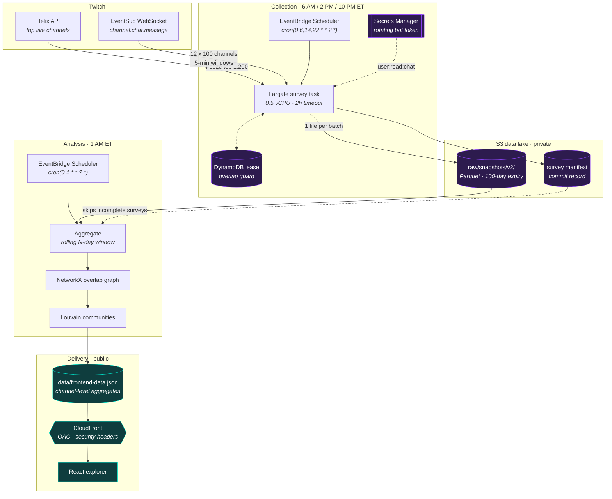

# ViewerAtlas

[](https://github.com/Von-Van/vieweratlas/actions/workflows/ci.yml)
[](https://github.com/Von-Van/vieweratlas/actions/workflows/security.yml)
[](LICENSE)

ViewerAtlas is an open-source data pipeline and interactive visualization for
mapping Twitch communities through shared audience presence. It turns sampled
chat participation into a weighted channel-overlap graph, detects communities
with the Louvain algorithm, and exports an explorable React frontend.

> **Deployment status:** the repository supports the live AWS deployment
> described below. A local frontend still labels its bundled demonstration
> dataset and switches to validated aggregate data when `VITE_DATA_URL` is
> configured.

## Why It Is Interesting

- End-to-end system: Twitch collection, Parquet storage, graph analysis, and a
  production-built visualization
- Local and AWS execution paths with Docker, ECS, S3, DynamoDB, CloudFront,
  EventBridge Scheduler, monitoring, rollback, and cost controls
- Privacy-conscious public boundary: raw presence data stays private while the
  browser receives channel-level aggregates
- Security gates for Python and npm dependencies, static analysis, tests,
  frontend type checking, and deployment preflight validation

## Architecture

Collection, analysis, and delivery are three independent stages joined only by
S3. Nothing runs continuously: EventBridge Scheduler starts a one-shot Fargate
task, it exits, and the private data it writes is never served to the browser.



Purple nodes hold private data — observed chatter IDs never leave them. Teal
nodes are public: only channel-level aggregates cross that boundary. See
[Public Data Boundary](#public-data-boundary).

| Stage | AWS | Cadence |
| --- | --- | --- |
| Collect | EventBridge Scheduler → Fargate, DynamoDB lease, Secrets Manager | 3x daily, ~80 min |
| Store | S3 (versioned, private, 100-day expiry) | per batch |
| Analyse | EventBridge Scheduler → Fargate | daily, 1 AM ET |
| Serve | S3 + CloudFront (Origin Access Control) | on deploy |

## What It Does

1. Discovers channels through the Twitch Helix API.
2. Samples unique active message authors through EventSub in equal five-minute
   channel batches; it does not collect lurkers or message text.
3. Keeps the older VOD preprocessor available only for local development; VOD
   collection is disabled in the production deployment.
4. Aggregates snapshots into channel-to-viewer sets.
5. Builds a weighted overlap graph where shared viewers determine edge weight.
6. Detects and labels communities.
7. Exports PNG, HTML, CSV, JSON, and frontend-ready aggregate artifacts.

## Methodology and Its Limits

**What is measured.** A survey subscribes to `channel.chat.message` for a batch
of channels and records the unique authors who send at least one message during
a shared five-minute window. Lurkers are invisible to this method, and message
text is never stored. Every number the site reports as "shared chatters" is a
count of *observed message authors*, not of viewers.

**Why that is a lower bound.** Each survey samples a small slice of a channel's
audience. Intersecting two sparse samples recovers roughly the product of their
sampling fractions, so a measured overlap is far smaller than the true shared
audience and grows super-linearly as surveys accumulate. Comparisons are
meaningful between channels in the same run; absolute values are not audience
estimates.

**Edge weight.** `weighting_mode` selects the formula:

| mode | weight | use |
| --- | --- | --- |
| `shared_count` | \|A ∩ B\| | raw intersection; favours channels sampled more often |
| `jaccard` | \|A ∩ B\| / \|A ∪ B\| | size-normalised similarity |
| `overlap_coef` | \|A ∩ B\| / min(\|A\|,\|B\|) | how much of the *smaller* audience is shared |

Survey cohorts churn, so channels are sampled at very different depths. A raw
count partly measures sampling effort, which is why the normalised modes exist
and why `min_channel_observations` can exclude channels seen only once or twice.

Whatever weight drives the graph, the public payload always carries the measured
integer count, so the published number stays a real observation rather than a
model output.

**Known limitations.** Chatters are deduplicated by login rather than by the
stable Twitch ID already captured, so a rename counts twice.
`max_viewer_channel_degree` drops very high-degree chatters entirely instead of
down-weighting them. Neither the threshold nor the community-size floor has yet
been calibrated against a full retention window.

## Public Data Boundary

Raw presence snapshots contain Twitch author IDs and logins and must remain private.
Those are pseudonymous identifiers and may still be personal data. The
public frontend is designed to receive only the `data/frontend-data*.json`
exports, which contain channel-level nodes, overlaps, community labels, and
aggregate metrics. The analysis publishes one per rolling window — 14, 30 and 90
days — for the map's time filter, all sharing a single schema.

See [DATA_POLICY.md](twitchiobot/docs/DATA_POLICY.md) for the full operational
policy and [SECURITY.md](SECURITY.md) for reporting and deployment guidance.

## Run Locally

### Pipeline

```bash
cd twitchiobot
python -m pip install -r requirements-dev.txt
cp config/.env.example .env
pytest -q
python src/main.py analyze default
```

The production survey uses the guided authorization step in the deployment
guide. It atomically stores the Client ID, Client Secret, bot account ID,
access token, and refresh token together in one AWS Secrets Manager secret;
none of those values belongs in the deployment `.env` file.

### Frontend

```bash
cd frontend
npm ci
npm run typecheck
npm run dev
```

Without `VITE_DATA_URL`, the interface uses a visibly labeled demonstration
dataset. Production builds use `/data/frontend-data.json`, matching the pipeline
export and CloudFront path.

## Runtime Modes

Run from `twitchiobot/`:

```bash
python src/main.py analyze [default|rigorous|explorer|debug|config.yaml]
python src/main.py survey config.yaml
```

The older VOD command is not part of the supported production rollout.

## Deployment Design

The included AWS scripts model a production deployment with private S3 buckets,
CloudFront Origin Access Control, least-privilege task roles, Secrets Manager,
non-root containers, monitoring, rollback, and conservative cost limits.

```bash
cd twitchiobot/infrastructure/aws
export AWS_PAGER=""
./authorize-twitch.sh
./safe-deploy.sh
SURVEY_SCHEDULE_STATE=DISABLED \
ANALYSIS_SCHEDULE_STATE=DISABLED \
./create-schedules.sh
./apply-monitoring.sh
./run-survey-test.sh small
./run-survey-test.sh batch
./run-survey-test.sh full
SURVEY_SCHEDULE_STATE=ENABLED \
ANALYSIS_SCHEDULE_STATE=ENABLED \
./create-schedules.sh
# Optional, once surveys have accumulated:
DISTRIBUTION_ID=<id> ./enable-access-logs.sh
../../scripts/calibrate_windows.sh
```

Run that sequence in order; do not enable the schedules unless all three tests
pass. A full survey takes roughly 80 minutes and has a two-hour safety limit.
The enabled schedules run surveys at 6:00 AM, 2:00 PM, and 10:00 PM Eastern and
analysis at 1:00 AM Eastern. These commands create real cloud resources and
costs, so review the deployment guide and environment template first.
For an already validated installation, use the shorter redeployment sequence in
[DEPLOYMENT.md](twitchiobot/docs/DEPLOYMENT.md); it includes the frontend sync,
one immediate analysis run, verification, and schedule re-enable.

## Repository Map

- `frontend/`: React, TypeScript, Vite, and the interactive graph explorer
- `twitchiobot/src/`: collection, storage, graph analysis, and frontend export
- `twitchiobot/tests/`: pipeline, reliability, and collection-state tests
- `twitchiobot/infrastructure/`: Docker and AWS deployment assets
- `twitchiobot/scripts/`: threshold sweeps and per-window calibration
- `.github/workflows/`: CI, security auditing, and deploy preflight checks

## Documentation

- [Frontend guide](frontend/README.md)
- [Deployment guide](twitchiobot/docs/DEPLOYMENT.md)
- [Daily operations](twitchiobot/docs/DAILY_OPERATIONS.md)
- [Developer guide](twitchiobot/docs/DEVELOPER.md)
- [Data policy](twitchiobot/docs/DATA_POLICY.md)
- [Security policy](SECURITY.md)

## License

MIT. See [LICENSE](LICENSE).
