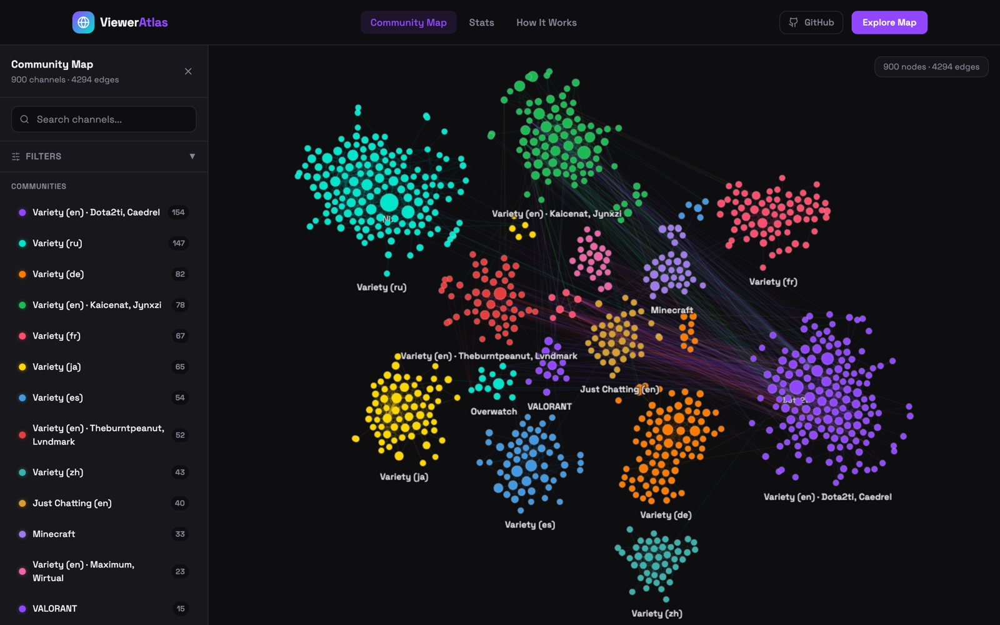

# ViewerAtlas

[](https://github.com/Von-Van/vieweratlas/actions/workflows/ci.yml)
[](https://github.com/Von-Van/vieweratlas/actions/workflows/security.yml)
[](LICENSE)

ViewerAtlas maps which Twitch channels share an active audience. Three times a
day it records who chats in the roughly 1,200 most-watched live channels. It
then builds a graph in which two channels are linked by the number of chatters
they share, finds communities in that graph with the Louvain algorithm, and
publishes the result as an interactive map.



*The map produced from 42 surveys (2026-08-13 to 2026-08-26). It shows 900 of
the 2,748 analysed channels, coloured by detected community, rendered locally
from the pipeline's public output.*

## Why ViewerAtlas?

Twitch shows who is live and how many people are watching. It does not show
how audiences overlap: which streamers draw on the same people, or whether a
"scene" around a game or a language is a real community or just a category.
ViewerAtlas answers that from behaviour rather than labels. If the same
accounts chat in two channels, those channels share part of an audience, and
groups of channels that share far more with each other than with everyone else
form a community.

ViewerAtlas was inspired by [Twitch Atlas](https://twitchatlas.com/), Kiran
Gershenfeld's 2020 map of Twitch communities. It linked streamers whose hourly
viewer lists overlapped by more than 300 people
([write-up](https://towardsdatascience.com/insights-from-visualizing-public-data-on-twitch-a73304a1b3eb/)).
ViewerAtlas started from those settings, but on five-minute samples of active
chatters a 300-person threshold produces no edges at all. Its thresholds are
therefore measured from its own data.

[twitchmap](https://twitchmap.com/) is a similar and more widely known map,
also inspired by Twitch Atlas. It listens to chat in the top ~1,000 channels
around the clock, weights overlap toward loyal chatters, and rebuilds every ~6
hours from a rolling ~10-day window. ViewerAtlas takes a different approach. It
samples the top ~1,200 channels in equal five-minute windows three times a day,
counts every shared chatter equally, and publishes a daily map for each rolling
window (14, 30, and eventually 90 days). Its code, sampling design, bot
filtering, threshold calibration, and limitations are all published in this
repository.

## What It Measures

| | Quantity | Source |
| --- | --- | --- |
| **Observed** | For each surveyed channel and five-minute window, the set of accounts that sent at least one chat message (user ID and login; never message text) | EventSub `channel.chat.message` |
| **Observed** | Stream metadata at the start of each survey: concurrent viewers, category, language, rank | Helix `GET /streams` |
| **Derived** | Shared chatters between two channels over a rolling 14-, 30-, or 90-day window | Union of samples, then set intersection |
| **Derived** | Communities, modularity, and community labels (dominant game or language) | Louvain; `cluster_tagger.py` |
| **Published** | Channel-level aggregates only: the capped graph, communities, and mean viewers and trends per channel | `data/frontend-data*.json` |

Two cautions shape how the numbers should be read:

- A **chatter** is someone who sent a message during a sampled window.
  Lurkers are invisible.
- Shared-chatter counts are **lower bounds** that grow with the number of
  surveys. They compare channel pairs within one window; they do not measure
  audience size.

## How It Works

```text
Twitch Helix + EventSub
   │  survey: 3x daily, 12 batches of <=100 channels, one shared 5-minute window per batch
   ▼
private Parquet + manifest (S3)
   │  aggregate each window → remove bots → overlap graph → Louvain → labels
   ▼
public JSON: capped, channel-level only (S3 + CloudFront)
   │
   ▼
React map with 14 / 30 / 90-day filter
```

| Stage | Code | Output |
| --- | --- | --- |
| Collection | [`update_channels.py`](twitchiobot/src/update_channels.py), [`eventsub_survey.py`](twitchiobot/src/eventsub_survey.py) | `raw/snapshots/v2/…/batch=NN.parquet` and `manifest.json` |
| Storage | [`storage.py`](twitchiobot/src/storage.py) | S3, or a local directory with the same keys |
| Processing | [`data_aggregator.py`](twitchiobot/src/data_aggregator.py), [`chatter_filter.py`](twitchiobot/src/chatter_filter.py) | Per-channel chatter sets for each window, with bots removed |
| Analysis | [`graph_builder.py`](twitchiobot/src/graph_builder.py), [`community_detector.py`](twitchiobot/src/community_detector.py), [`cluster_tagger.py`](twitchiobot/src/cluster_tagger.py) | Overlap graph, communities, labels |
| Publication | [`frontend_exporter.py`](twitchiobot/src/frontend_exporter.py) | `data/frontend-data*.json` |
| Visualization | [`frontend/`](frontend/) | Interactive map, channel pages, statistics |

[docs/data-pipeline.md](docs/data-pipeline.md) walks through each stage and
its data formats.

## Example Results

These are real results from the 14-day sample: 42 surveys, 2026-08-13 to
2026-08-26, analysed with the production preset. They were regenerated on
2026-09-22 with the code in this repository, and only aggregates were read.

| Step | Result |
| --- | --- |
| Channel samples loaded | 47,864, covering 11,835 distinct channels |
| Distinct chatters, after removing 229 automated accounts | 897,865 |
| Channels observed at least 3 times with at least 10 chatters | 5,082 |
| Overlap graph at the 14-day threshold (3 shared chatters) | 3,246 channels, 13,055 edges |
| Louvain communities of at least 10 channels | 36 communities (2,748 channels), modularity 0.81 |
| Public map | 900 channels, 4,294 edges, 19 communities |

Three findings from that run:

- **Bots dominate raw overlap.** 229 accounts, 0.03% of all chatters,
  supplied 97% of every channel-pair overlap increment. Left in, they would
  have added 681 edges (5% of the unfiltered graph) that link channels
  through bots alone.
- **Communities follow language and game.** Every detected community has a
  dominant attribute: 13 have one game on at least 60% of their channels, and
  the other 23 share a broadcast language on at least 40%. Neither attribute
  is an input to community detection, so this agreement shows the overlap
  signal carries real structure. It does not explain why audiences cluster.
- **The signal is sparse.** 86% of chatters appear in only one channel. The
  graph is built from the roughly 122,000 who appear in two or more.

On synthetic data with eight planted communities
([`make_demo_data.py`](twitchiobot/scripts/make_demo_data.py)), the same
pipeline recovers all eight planted communities. See
[methodology.md](docs/methodology.md#validation-performed).

## Technical Architecture

Collection, analysis, and delivery are independent one-shot jobs joined only
by S3. Nothing runs continuously.

- **Pipeline:** Python 3.11 with TwitchIO (EventSub), pandas and PyArrow,
  NetworkX, and python-louvain, covered by a pytest suite that needs no network
  or credentials.
- **AWS:** EventBridge Scheduler starts ECS Fargate tasks. Data sits in a
  private S3 data lake with lifecycle expiry. A DynamoDB lease prevents
  overlapping surveys, and Secrets Manager holds the rotating bot credential.
  The site is served by CloudFront with Origin Access Control and security
  headers, and CloudWatch alarms and a budget watch for failures and cost.
- **Frontend:** React 18, TypeScript, and Vite. The page draws a layout the
  pipeline precomputed and validates every payload before rendering it.
- **CI and security:** tests, compile and shell checks, frontend typecheck and
  build, pip-audit, Bandit, npm audit, and Dependabot.

[docs/architecture.md](docs/architecture.md) has the full component map,
infrastructure diagram, and design decisions.

## Running ViewerAtlas

You can run the whole pipeline without a Twitch account, on synthetic surveys:

```bash
git clone https://github.com/Von-Van/vieweratlas.git
cd vieweratlas/twitchiobot
python3.11 -m venv .venv && source .venv/bin/activate
python -m pip install -r requirements-dev.txt
pytest -q
python scripts/make_demo_data.py
STORAGE_TYPE=file LOGS_DIR=demo_data python src/main.py analyze rigorous
```

To view the output in the frontend (Node.js 22):

```bash
cd ../frontend
npm ci
mkdir -p public/data && cp ../twitchiobot/demo_data/data/frontend-data*.json public/data/
VITE_DATA_URL=/data/frontend-data.json npm run dev
```

- **Real data.** Collecting your own surveys needs a Twitch application and a
  bot token with the `user:read:chat` scope; see
  [docs/development.md](docs/development.md#collect-real-data-locally).
- **Cloud deployment.** Scheduled AWS collection follows
  [twitchiobot/docs/DEPLOYMENT.md](twitchiobot/docs/DEPLOYMENT.md). Those
  scripts create real resources and costs.
- **Reproducibility.** Production survey data is personal data and is not
  distributed. The synthetic path reproduces the pipeline, not the published
  results.

## Data Schema

Every stage reads and writes a single storage tree. The keys are the same in S3
and in a local directory:

```text
<storage root>/
├── raw/snapshots/v2/date=YYYY-MM-DD/session=<id>/     private, expires after 100 days
│   ├── batch=NN.parquet           one row per channel planned in the batch
│   └── manifest.json              survey status and per-batch counts
├── processed/analysis_results.json                    private record of the latest run
├── curated/analysis/YYYY-MM-DD/graph_nodes.csv        private: id, viewers, viewer_count, game, title
├── curated/analysis/YYYY-MM-DD/graph_edges.csv        private: source, target, weight
└── data/frontend-data.json, frontend-data-<N>d.json   public, one per analysis window
```

**Survey batch** (`batch=NN.parquet`, schema version 2, private):

| Column | Type | Contents |
| --- | --- | --- |
| `survey_session_id` | string | Survey ID; by default its UTC start time |
| `batch`, `rank` | int64 | Batch number (from 1) and position in the frozen Helix ranking |
| `schema_version` | int64 | `2` |
| `channel_id` | string | Broadcaster user ID |
| `channel`, `channel_login` | string | Broadcaster login, lowercase (both columns hold it) |
| `viewer_count` | int64 | Helix concurrent viewers when the cohort was frozen |
| `game_id`, `game_name`, `language`, `title` | string | Helix stream metadata at the same moment |
| `started_at`, `discovered_at` | string (ISO 8601) | When the stream went live; when the cohort was frozen |
| `sample_started_at`, `sample_ended_at`, `timestamp` | string (ISO 8601) | The batch's shared listening window. `timestamp` repeats the start. |
| `sample_duration_seconds` | int64 | 300 for completed rows, 0 for failed ones |
| `collection_status`, `failure_reason` | string | `completed`, `subscription_failed`, or `websocket_failed`, plus a fixed failure category |
| `unique_author_count` | int64 | Distinct chatters in the window |
| `chatter_ids_json`, `chatters_json` | string (JSON array) | Chatter user IDs and lowercase logins, aligned and sorted by ID. Never message text. |
| `selection_source`, `_source` | string | Always `top_ranked` and `live` today |

**Survey manifest** (`manifest.json`, private). `status` is `running`,
`complete`, `complete_with_errors`, or `partial`. Only `complete` and
`complete_with_errors` surveys are analysed.

The manifest also records:

- `started_at` and `completed_at`;
- the configured limits: `target_limit`, `batch_size`, `window_seconds`,
  `timeout_seconds`;
- survey-wide counts: `planned`, `attempted`, `completed`, `failed`,
  `zero_authors`, `batches_planned`, `batches_completed`;
- a `batches` array with each batch's counts and the `object_key` of its file.

A `partial` survey also carries `failure_reason`, and an `error` category when
an exception caused it.

**Public payload** (`data/frontend-data*.json`). This is the only data the
website receives, and the frontend validates it against this shape
([`validateAtlasData.ts`](frontend/src/app/data/validateAtlasData.ts)) before
rendering anything:

```ts
type FrontendData = {
  generatedAt: string;                 // ISO time of the export
  availableWindows?: number[];         // e.g. [14, 30]; window keys are omitted in single-window runs
  pendingWindows?: number[];           // e.g. [90]: configured, but not enough history yet
  defaultWindow?: number;              // the window the site opens on
  overallStats: {
    totalChannels: number;             // channels in the analysed graph
    totalViewers: number;              // distinct chatters (not viewers) in the window
    communitiesDetected: number;
    modularityScore: number;
    collectionPeriod: string;          // e.g. "Aug 13 – Aug 26, 2026"
    dataPoints: number;                // channel samples loaded
    edgesTotal: number;
    avgOverlapWeight: number;          // mean shared chatters per rendered edge
    renderedChannels: number;
    renderedEdges: number;
  };
  communities: { id: string; label: string; color: string; nodeCount: number; description: string }[];
  channels: {
    id: string;                        // lowercase login (also `name`)
    name: string;
    displayName: string;
    game: string;                      // most frequent category in the window
    viewers: number;                   // mean concurrent viewers while live (Helix)
    communityId: string;
    description: string;
    language: string;                  // broadcaster language, e.g. "En"
    topOverlaps: { channelId: string; channelName: string; shared: number }[];  // up to 5
    viewerHistory: { date: string; viewers: number }[];                         // one point per day
    edgeCount: number;                 // links on the rendered map (at most 25)
    modularityScore: number;           // share of those links inside the channel's community
    layout?: { x: number; y: number }; // position precomputed by the pipeline
  }[];
  edges: { source: string; target: string; weight: number }[];  // weight = shared chatters (integer)
  topCommunitiesBySize: { community: string; channels: number; viewers: number }[];      // top 8
  mostConnectedChannels: { name: string; edges: number; community: string; color: string }[];  // top 10
};
```

`processed/analysis_results.json` holds the full partition, the labels, the run
statistics, and the configuration that produced them.
[docs/metrics.md](docs/metrics.md) defines every field, and
[docs/data-pipeline.md](docs/data-pipeline.md) explains how each one is
produced.

## Data & Methodology

- [Data pipeline](docs/data-pipeline.md): sources, formats, storage layout,
  and every transformation, with the code that performs it.
- [Methodology](docs/methodology.md): sampling design, bot removal, threshold
  calibration, community detection, labelling, validation, and interpretation.
- [Metrics reference](docs/metrics.md): what each published field measures
  and how to read it.
- [Data policy](twitchiobot/docs/DATA_POLICY.md): what is stored, for how
  long, and who can see it.

**Privacy.** Raw survey files hold Twitch user IDs and logins, which are
pseudonymous personal data. They stay in a private bucket and expire after 100
days. The public site receives only channel-level aggregates, and a
post-deployment smoke test checks that every public payload contains no chatter
identities.

## Limitations

- **Chatters, not viewers.** Lurkers are invisible, and chat-heavy channels,
  genres, and cultures are over-represented.
- **A sample, not a census.** Samples are three five-minute windows a day at
  fixed US Eastern times, across the top ~1,200 live channels. Other channels,
  hours, and time zones are under-covered.
- **Counts depend on sampling effort.** Overlap counts grow faster than
  linearly with surveys and with how often a channel was sampled, so they
  compare pairs within one window only.
- **Heuristic cleaning.** Bot removal can drop a rare human who chats in four
  or more surveyed chats within five minutes, and can miss unlisted bots.
  Chatters are matched by login, so a rename counts twice.
- **Calibration is a judgment.** The 14- and 30-day thresholds were measured
  before the bot filter existed and are due to be re-measured. The 90-day
  window has no measured threshold yet.
- **Observational.** The map shows where audiences overlap, not why: not
  raids, recommendations, or migration.
- **A projection.** The public map shows the 1,000 most-watched analysed
  channels, with at most 25 links each.

The complete list, with mitigations, is in
[methodology.md](docs/methodology.md#limitations-and-known-biases).

## Project Status

| Area | Status |
| --- | --- |
| EventSub survey collection (3× daily on AWS) | Production |
| Rolling-window analysis and the public map (14- and 30-day windows) | Production. The 90-day window publishes itself once 90 days of surveys exist. |
| Automated-account filter | Implemented; threshold re-measurement pending |
| Normalized edge weights (Jaccard, overlap coefficient) | Experimental: implemented and tested, not used in production |
| VOD chat preprocessor, PNG and HTML renders | Local development only; disabled in production |
| CloudFront access analytics (no viewer identifiers) | Optional |
| Identity by stable Twitch ID; broadcaster opt-in | Planned |

## Roadmap

1. Re-measure every window's overlap threshold with the bot filter active,
   and calibrate the 90-day window once it fills.
2. Key chatters by stable Twitch user ID instead of login.
3. Apply the rolling window to legacy inputs, or confirm none remain.
4. Revisit normalized edge weights once overlaps carry more magnitude.
5. Add Python and TypeScript linting to CI.

## Development Process

ViewerAtlas is built with AI coding assistants, which help with
implementation, debugging, refactoring, documentation, analysis, and review.
The project owner sets the research question, the data collected and
published, the metrics and analytical rules, and the architecture. The owner
also interprets and validates results and decides which changes are
accepted. Decisions are recorded next to the code that implements them, with
the measurements behind them. See
[docs/development.md](docs/development.md#development-process).

## Repository Map

| Path | Contents |
| --- | --- |
| [`twitchiobot/src/`](twitchiobot/src/) | Collection, storage, analysis, and export (Python) |
| [`twitchiobot/tests/`](twitchiobot/tests/) | pytest suite |
| [`twitchiobot/scripts/`](twitchiobot/scripts/) | Threshold calibration, survey inspection, Twitch authorization, synthetic data |
| [`twitchiobot/config/`](twitchiobot/config/) | `config.yaml` and the local `.env` template |
| [`twitchiobot/infrastructure/`](twitchiobot/infrastructure/) | Dockerfiles and AWS deployment, monitoring, and operations scripts |
| [`twitchiobot/docs/`](twitchiobot/docs/) | Operator runbooks, developer contracts, data policy |
| [`frontend/`](frontend/) | React map, channel pages, and statistics |
| [`docs/`](docs/) | Project documentation |
| [`.github/workflows/`](.github/workflows/) | CI, security audit, deploy preflight |

## Documentation

- [Architecture](docs/architecture.md), [Data pipeline](docs/data-pipeline.md),
  [Methodology](docs/methodology.md), [Metrics](docs/metrics.md),
  [Development](docs/development.md)
- [Frontend guide](frontend/README.md)
- [Deployment guide](twitchiobot/docs/DEPLOYMENT.md),
  [Daily operations](twitchiobot/docs/DAILY_OPERATIONS.md),
  [Developer contracts](twitchiobot/docs/DEVELOPER.md),
  [Data policy](twitchiobot/docs/DATA_POLICY.md)
- [Security policy](SECURITY.md)

## License

MIT. See [LICENSE](LICENSE).
