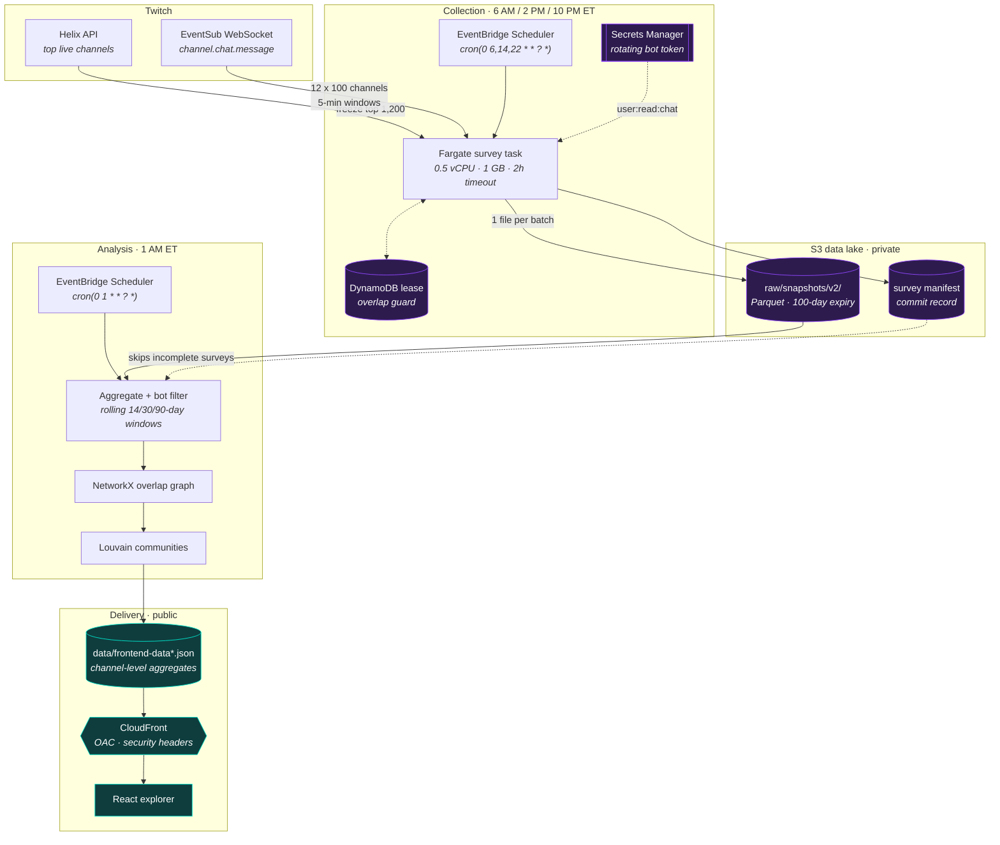

# Architecture

ViewerAtlas has three independent stages: collection, analysis, and delivery.
They are joined only by objects in S3. Nothing runs continuously. EventBridge
Scheduler starts a one-shot Fargate task, the task writes its output and
exits, and the private data it writes is never served to the browser.
Locally, the same code runs against a directory instead of S3.

Purple nodes hold private data: observed chatter IDs never leave them. Teal
nodes are public, and only channel-level aggregates cross into them.

## Components

### Pipeline (`twitchiobot/src/`, Python 3.11)

| Module | Responsibility |
| --- | --- |
| [`main.py`](../twitchiobot/src/main.py) | CLI (`survey`, `analyze`, `preprocess_vods`). `PipelineRunner` plans windows and runs aggregate → graph → communities → labels → publish → render for each window. |
| [`config.py`](../twitchiobot/src/config.py) | Dataclass configuration, four presets (`default`, `rigorous`, `explorer`, `debug`), and a strict YAML loader that rejects unknown keys. `get_rigorous_config()` is the production analysis preset, and its comments record why each value was chosen. |
| [`update_channels.py`](../twitchiobot/src/update_channels.py) | Helix `/streams` discovery. `TopStreamsProvider` freezes a ranked cohort. |
| [`eventsub_survey.py`](../twitchiobot/src/eventsub_survey.py) | `EventSubSurveyRunner` (batches, windows, retries, manifest) and `TwitchEventSubClient` (a TwitchIO 3.2.2 WebSocket adapter). |
| [`survey_lease.py`](../twitchiobot/src/survey_lease.py) | DynamoDB mutual-exclusion lease, or a no-op locally |
| [`twitch_credentials.py`](../twitchiobot/src/twitch_credentials.py) | Loads the single Secrets Manager credential and rotates its tokens atomically (environment variables locally) |
| [`storage.py`](../twitchiobot/src/storage.py) | `BaseStorage` with `S3Storage` and `FileStorage`. The same keys work in both. |
| [`data_aggregator.py`](../twitchiobot/src/data_aggregator.py) | Window selection, the manifest gate, row decoding, per-channel aggregation |
| [`chatter_filter.py`](../twitchiobot/src/chatter_filter.py) | Automated-account removal (known services and the concurrency rule) |
| [`graph_builder.py`](../twitchiobot/src/graph_builder.py) | Channel-overlap graph, weighting modes, thresholds, and `ordered_subgraph()` |
| [`community_detector.py`](../twitchiobot/src/community_detector.py) | Louvain wrapper with a minimum community size and modularity |
| [`cluster_tagger.py`](../twitchiobot/src/cluster_tagger.py) | Game and language community labels |
| [`frontend_exporter.py`](../twitchiobot/src/frontend_exporter.py) | Public projection, community identity across windows, and server-side layout |
| [`visualizer.py`](../twitchiobot/src/visualizer.py) | Optional PNG (matplotlib) and HTML (PyVis) renders. Off in production. |
| [`vod_collector.py`](../twitchiobot/src/vod_collector.py), [`daily_collection_state.py`](../twitchiobot/src/daily_collection_state.py) | Legacy VOD chat preprocessor. Local development only. |

### Frontend (`frontend/`, React 18 + TypeScript + Vite + Tailwind 4)

| Path | Responsibility |
| --- | --- |
| `src/app/data/AtlasDataProvider.tsx` | Fetches `VITE_DATA_URL` (same origin, with a timeout and size limit) and loads other windows on demand. Falls back to the labelled demo dataset. |
| `src/app/data/validateAtlasData.ts` | Schema and bounds validation of the payload before anything renders |
| `src/app/components/NetworkGraph.tsx` | Canvas renderer for the precomputed layout. Node radius scales with √viewers and edge width with shared chatters. |
| `src/app/pages/` | Landing, Community Map, Channel Detail, Stats, and About routes |
| `src/app/data/mockData.ts` | Demo dataset and shared TypeScript types |

### Tooling (`twitchiobot/scripts/`)

| Script | Purpose |
| --- | --- |
| [`sweep_threshold.py`](../twitchiobot/scripts/sweep_threshold.py) | Measure the overlap threshold on real surveys and print graph quality per candidate. Prints aggregates only. |
| [`calibrate_windows.sh`](../twitchiobot/scripts/calibrate_windows.sh) | Download once, then sweep every window with the production filters |
| [`inspect_survey.py`](../twitchiobot/scripts/inspect_survey.py) | Per-channel author counts for one survey, to spot silently empty captures |
| [`setup_twitch_auth.py`](../twitchiobot/scripts/setup_twitch_auth.py) | Guided OAuth authorization-code flow that writes the credential to Secrets Manager |
| [`make_demo_data.py`](../twitchiobot/scripts/make_demo_data.py) | Synthetic surveys in the v2 layout, for running everything without Twitch |

### Infrastructure (`twitchiobot/infrastructure/`)

| Asset | Purpose |
| --- | --- |
| `docker/Dockerfile.collector`, `Dockerfile.analysis` | Non-root Python 3.11 images. They run `main.py survey config.yaml` and `main.py analyze rigorous`. |
| `docker/docker-compose.yml` | Local container runs |
| `aws/safe-deploy.sh` → `deploy.sh` | Preflight and confirmation, then ECR, IAM, DynamoDB, image build and push, task definitions, bucket encryption, versioning, and lifecycle |
| `aws/create-schedules.sh`, `pause-schedules.sh`, `rollback.sh` | EventBridge Scheduler: create or enable, pause, and emergency disable |
| `aws/apply-monitoring.sh`, `monitoring-dashboard.yaml` | CloudWatch dashboard and milestone alarms, SNS email, budget, and lifecycle validation |
| `aws/run-survey-test.sh`, `run-analysis.sh`, `smoke-test.sh` | Canary surveys (`small` → `batch` → `full`), one-off analysis, and post-deploy checks including the privacy boundary |
| `aws/authorize-twitch.sh` | Wrapper for `setup_twitch_auth.py` |
| `aws/cloudfront-setup.sh` | One-time S3 and CloudFront setup: Origin Access Control, security headers, SPA error routing. Run manually. |
| `aws/enable-access-logs.sh`, `analytics-schema.sql` | Optional CloudFront access logs with no viewer identifiers, plus an Athena table over them |
| `aws/promote.sh` | Promotes a staging image tag to the production cluster |
| `aws/ecs-task-*.json` | Fargate task definitions: collector 0.5 vCPU / 1 GB, analysis 1 vCPU / 2 GB |

[DEPLOYMENT.md](../twitchiobot/docs/DEPLOYMENT.md) and
[DAILY_OPERATIONS.md](../twitchiobot/docs/DAILY_OPERATIONS.md) are the
operator runbooks.

## Technology stack

| Layer | Technology |
| --- | --- |
| Collection | Twitch Helix REST (`requests`), EventSub WebSocket via TwitchIO 3.2.2 |
| Storage | Parquet (pandas + PyArrow), JSON manifests, S3 (boto3) or the local filesystem |
| Analysis | NetworkX 3.2, python-louvain 0.16, NumPy, SciPy (large spring layouts) |
| Frontend | React 18, React Router 7, Recharts, Tailwind CSS 4, Vite 6, TypeScript |
| Cloud | ECS Fargate, EventBridge Scheduler, S3, CloudFront, DynamoDB, Secrets Manager, CloudWatch, SNS, AWS Budgets |
| Quality | pytest, GitHub Actions CI, pip-audit, Bandit, npm audit, Dependabot |

## Key design decisions

Each decision below is recorded where it is implemented. The evidence column
points to that record.

| Decision | Why | Evidence |
| --- | --- | --- |
| Scheduled one-shot surveys instead of a continuous chat collector | No collector running all day. Every channel in a batch gets an equal, shared window. Separate SQS workers were retired because they could not safely share Twitch's 100-room limit for one account. | [DEPLOYMENT.md](../twitchiobot/docs/DEPLOYMENT.md) ("What is intentionally not active"), `sweep_threshold.py` docstring |
| Restart a batch after a WebSocket loss instead of patching it | EventSub has no replay, so a patched window would not be common to all channels | `_run_batch()` in `eventsub_survey.py` |
| The manifest is the commit record | Batches land before the terminal status, so interrupted surveys must be skipped | `_v2_session_is_analyzable()` in `data_aggregator.py` |
| Rolling windows anchored to the newest survey | An unbounded union makes density and thresholds drift. Anchoring to data makes replays reproducible. | `analysis_window_days` comment in `config.py`, `_select_keys_in_window()` |
| Windows publish themselves only when the data covers them | A 90-day label on 14 days of data would mislead | `window_plan()` in `main.py` |
| Remove automated accounts at analysis time, report counts only | Rules apply retroactively. The classification can misjudge a person, so it is never stored. | `chatter_filter.py` docstring |
| Measure the overlap threshold per window, and choose the knee rather than the peak | Overlap grows super-linearly with surveys. Peak modularity over-prunes the map. | `get_rigorous_config()` comments; [methodology.md](methodology.md#calibrating-the-overlap-threshold) |
| Publish only channel-level aggregates, and publish before rendering | Privacy boundary. A render that runs out of memory cannot freeze the public dataset (it did once for three days). | `_run_window()` comment, `smoke-test.sh` privacy check |
| Server-side layout, capped public graph | The browser draws a legible, bounded map instead of running physics on thousands of nodes | `_compute_layout()` and `FrontendExportConfig` in `frontend_exporter.py` |
| Deterministic output | Day-to-day movement on the map should reflect data, not seeds or hash order | `random_state=42`, `ordered_subgraph()`, sorted edge insertion, label tie-breaks |

## Testing and CI

- [`ci.yml`](../.github/workflows/ci.yml) runs pytest, `compileall` on
  `src/`, `scripts/`, and `tests/`, `bash -n` on every shell script, parses
  the AWS JSON, and runs the frontend's `npm ci`, typecheck, and build.
- [`security.yml`](../.github/workflows/security.yml) runs `pip-audit` with an
  OSV severity gate, Bandit (fails on HIGH), and `npm audit --audit-level=high`.
- [`deploy-preflight.yml`](../.github/workflows/deploy-preflight.yml) is run
  manually. It validates deployment variables and repeats the static checks.
- Tests inject fake Twitch clients, credential stores, and S3 storage, so none
  of them need network access or real credentials.
